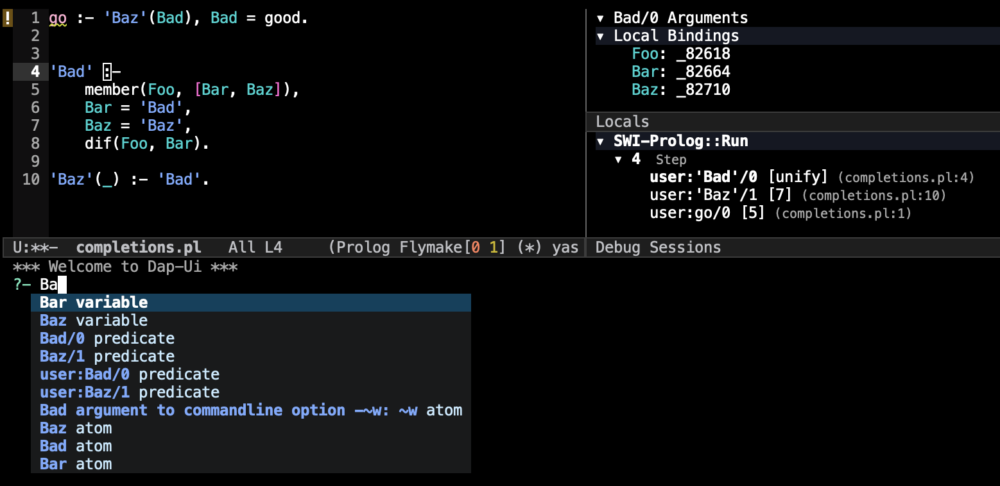
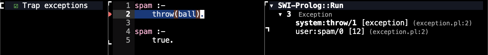

# What's new in SWI-Prolog Debug Adapter version 0.7.2

The following changes were introduced since version 0.7.1 of the
`debug_adapter` package:

## Runtime aware completions

The SWI-Prolog Debug Adapter server now supports the
[`completions`](https://microsoft.github.io/debug-adapter-protocol/specification#Requests_Completions)
DAP request, which is used by IDE clients to provide completion
suggestions for user input based on the current state of the Prolog
runtime.

In `dap-mode`, the provided completions are used in the DAP REPL:


Note how in the image above completions suggestions appears for
variable names, but only for those variables that are currently
accessible in the selected Prolog execution frame, as evaluation in
the DAP REPL takes place in the context of the paused Prolog
execution.

## Special handling for proper lists in `variables` requests

Prior to this version, the DAP server treated Prolog lists just like
any other compound term (of arity 2) when it came to reporting
variable bindings etc., which caused lists to be presented to the user
as a deeply nested `'[|]'/2` compound term.

Version 0.7.2 adds a special case for proper lists and reports them a
flat list in the DAP encoding, which is reflected accordingly to the
user. For improper lists, the old behavior is retained and they are
reported as nested binary compound terms, which they are.


# What's new in SWI-Prolog Debug Adapter version 0.7.1

The following changes were introduced since version 0.7.0 of the
`debug_adapter` package:

## New extensible interface for choosing DAP clients from the top-level

When using SWI-Prolog through the regular built-in top-level, users
can start a DAP session to interactively debug top-level queries by
simply loading `library(swipl_debug_adapter)`.

The `swipl_debug_adapter` installs a tracer hook that causes
SWI-Prolog to start a DAP-supporting IDE (client) in an external
process and connect it to the running top-level thread through a local
TCP connection to form a DAP interactive debugging session. The DAP
client is started at the first occasion in which the tracer is
hit. This is a similar feature to `gtrace/0` as provided by
SWI-Prolog's built-in graphical debugger, except that loading
`library(swipl_debug_adapter)` will not cause Prolog to go into trace
mode, instead one can explicitly call `trace/0` to start tracing the
next goal, or `trap/0` to start tracing only when an exception is
thrown, and so on.

For more details and for information about configuring how
`swipl_debug_adapter` starts the user's IDE, see the documentation for
`swipl_debug_adapter_client_command/4`.

# What's new in SWI-Prolog Debug Adapter version 0.7.0

The following changes were introduced since version 0.6.3 of the
`debug_adapter` package:

## Generalized DAP server interface

Version 0.7.0 brings with it a major refactor of the `debug_adapter`
package code-base intended to facilitate reuse of the provided
implementation of the DAP specification for debugging different
_target languages_.  This is mostly envisioned to benefit languages
and extensions implemented on top of SWI-Prolog, where the
implementation of a DAP server from scratch may not seem
cost-effective. With the new generalized interface provided in
`library(debug_adapter)`, such languages can gain DAP support that is
specific to their syntax and semantics by implementing a
simple callback based interface that abstracts away many details of
implementing a DAP server.

The interface currently consists of a single "callback" predicate that
needs to be implemented for each new DAP server. This predicate is
passed to `da_server/1`, the main entry point for running a DAP
server. `da_server/1` is completely unaware of the specifics of the
target language though, and relies on the provided callback for
handling incoming DAP requests after. For more details see the
documentation in `library(debug_adapter/server)` for more details.

All of the logic that is specific for debugging SWI-Prolog (for which
SWI-Prolog is the _target_ language, not merely the implementation
language) has been moved from `library(debug_adapter)` to
`library(swipl_debug_adapter)`. A large portion of the SWI-Prolog
debug adapter server has been rewritten in order to adhere to the new
interface, without any known regressions or noticeable modifications
in terms of the user/client facing behavior of the server (see next
section about testing).


## Smarter and more comprehensive test-suite

As noted in the previous section, the changes introduced in version
0.7.0 touched a lot of code are intended to be fully backwards
compatible. To minimize regressions, end-to-end tests where created
for each of the supported features, providing much greater test
coverage compared to prior versions.

In order to streamline writing end-to-end tests,
`library(debug_adapter)` was enhanced with a powerful DAP _client_
implementation, which supports a nice little DSL for writing so-called
DAP _scripts_. The DSL, called simply `dapscript`, is implemented in
`library(debug_adapter/script)` and facilitates describing and
executing elaborate debugging _sessions_ with an external DAP server
started in a separate process. Hence it can be used for testing (or,
more generally, programming) any DAP server.

`dapscript` will hopefully be thoroughly documented in the
future. Many examples can be found in the [`test/scripts` subdirectory
of the `debug_adapter` git
repository](https://github.com/eshelyaron/debug_adapter/tree/main/test/scripts).


# What's new in SWI-Prolog Debug Adapter version 0.6.3

The following changes were introduced since version 0.6.0 of the
`debug_adapter` package:

## MS Windows Compatibility

In versions 0.6.0 and before, `debug_adapter` relied on Unix-specific
features for some of its I/O tasks, namely:

* The DAP server thread used
  [`wait_for_input/3`](https://www.swi-prolog.org/pldoc/man?predicate=wait_for_input/3)
  on the stdin stream to wait for input from the DAP client, and
* [`pipe/2`](https://www.swi-prolog.org/pldoc/man?predicate=pipe/2) was used for some inter-thread/process communication.

These features are not available on MS Windows, rendering previous
versions `debug_adapter` not compatible with the platform.

Version 0.6.2 of the `debug_adapter` package thus included an uverhaul
of the DAP server's stdin listening implementation so to alleviate the
reliance on Unix-specific features and allow the `debug_adapter` to
run smoothly (also) on MS Windows.

A Windows host was also added as a target for runnning the automated
test-suite in CI.

## Reporting and reseting breakpoints removed during source code reload

The [SWI-Prolog
manual](https://www.swi-prolog.org/pldoc/man?section=loadrunningcode)
states that:

> Traditionally, Prolog environments allow for reloading files holding
> currently active code. In particular, the following sequence is a
> valid use of the development environment:
>
>  * Trace a goal
>  * Find unexpected behaviour of a predicate
>  * Enter a _break_ using the **b** command
>  * Fix the sources and reload them using [`make/0`](https://www.swi-prolog.org/pldoc/man?predicate=make/0)
>  * Exit the break, _retry_ executing the now fixed predicate using the **r** command

This flow is of course fully supported by the `debug_adapter` package,
but what if we want to change this flow slightly, and instead of
starting out tracing a goal from the top, we want to set a breakpoint
somewhere down the road to be triggered at some point in our program's
execution, and only then start the trace-edit-make-retry loop?

Sounds straightforward enough, but there's a problem - SWI-Prolog does
not preserve breakpoints when reloading source code. This is not
surprising since breakpoints are internally attached to specific
clauses, and clauses are replaced garbage collected by
[`garbage_collect_clauses/0`](https://www.swi-prolog.org/pldoc/man?predicate=garbage_collect_clauses/0)
after reloading relevant source file. This means that the next time
our program reaches the point were we previously set our breakpoint,
it may already not be present since reloading the source file. Even if
the source code wasn't changed, reloading will eventually replace the
file's clauses with fresh variants.

In order to deal with this problem and fully support the
aforementioned break-edit-make-retry workflow, version 0.6.3 of the
`debug_adapter` package now detects breakpoints that are removed due
to clause garbage collection and reports this information back to the
client IDE via a DAP `breakpoint` event with `reason : "removed"`.


# What's new in SWI-Prolog Debug Adapter version 0.6.0

The following changes were introduced since version 0.5.0 of the
`debug_adapter` package:

## Added support for jumping to a choicepoint by force-failing the current goal

The `debug_adapter` server now interprets the `targetId` field of the
[`stepIn`](https://microsoft.github.io/debug-adapter-protocol/specification#Requests_StepIn)
DAP request to determine from where the execution of the debuggee
should be commenced, i.e. whether to perform a regular "step in" along
the programs execution or to alter the state of the debuggee such that
it continues to run from some other point.

To obtain the set of possible "targets" the debuggee can step into at
a certain time, clients issue a
[`stepInTargets`](https://microsoft.github.io/debug-adapter-protocol/specification#Requests_StepInTargets)
DAP request, to which the `debug_adapter` responds with an array of
possible targets. In deterministic contexts the server reports only
one possible target which corresponds to a regular "step in" down the
execution path, while in presence of choicepoints the server reports
with another target that can be specified in order to force-fail the
paused goal and continue execution in next choicepoint.

An appropriate end-to-end test of requesting `stepInTargets` before
and after the debuggee executes a cut (`!/0`), transitioning from a
nondeterministic context to a deterministic one, was added to the test
suite.


## Added support for exception breakpoints

Exception breakpoints are a standard DAP feature defined in [the
specification](https://microsoft.github.io/debug-adapter-protocol/specification),
which controls if and when the debuggee will be stopped upon throwing
an exception.
During session startup the server reports which
"filters" it supports for trapping exceptions. Each filter defines a
server-defined set of exception terms that the server will trap in the
current session.

The client can then use the
[`setExceptionBreakpoints`](https://microsoft.github.io/debug-adapter-protocol/specification#Requests_SetExceptionBreakpoints)
DAP request to apply or remove these filters in order to specify which
exceptions are propagated and which are trapped. Initially the server
does not trap any exceptions unless explicitly requested, and sending
a set of exception breakpoint filters to the server first clears any
existing exception breakpoints, hence a `setExceptionBreakpoints`
request specifying an empty filter array has a similar effect as the
query:
```prolog
?- notrap(_).
```

An end-to-end test of setting and hitting exception breakpoints was
added to the test suite.


The `debug_adapter` server currently supports only one filter, with the ID
"true" and the description "Trap exceptions", which corresponds to trapping
all thrown exceptions, i.e. has a similar effect as:
```prolog
?- gtrap(_).
```



## Added support for function breakpoints

Function breakpoints are a standard DAP feature defined in [the
specification](https://microsoft.github.io/debug-adapter-protocol/specification).
Function breakpoints allow the user to define runtime locations in
which the debuggee shall break in terms of specific runtime procedures
("functions", or in our case predicates), in contrast to plain
(source-)breakpoints which define break locations in terms of the
correlating source code.

Function breakpoints can now be set via the
[setFunctionBreakpoints](https://microsoft.github.io/debug-adapter-protocol/specification#Requests_SetFunctionBreakpoints)
standard DAP request specifying an array of Prolog predicate
indicators (e.g. `foo/2`). The `debug_adapter` server attempts to
install a spy point on each specified predicate using [`spy/1`](https://www.swi-prolog.org/pldoc/man?predicate=spy/1) and
responds with a array of DAP
[Breakpoint](https://microsoft.github.io/debug-adapter-protocol/specification#Types_Breakpoint)s
denoting for each predicate whether spying succeeded or failed via the
`verified` field of the corresponding element in the array.

Note that a new `setFunctionBreakpoints` request instructs the server
to remove all exiting function breakpoints before installing the new
ones, so for instance an empty array can be used to clear all function
breakpoints in a given debug session.

At runtime, if the debuggee calls a predicate that is being spied on,
the thread that hit the installed spy point is stopped and the
`debug_adapter` server reports an appropriate DAP
[`stopped`](https://microsoft.github.io/debug-adapter-protocol/specification#Events_Stopped)
event with the `reason` field set to "function breakpoint".

An end-to-end test of setting and hitting function breakpoints was
added to the test suite.


## Report which breakpoint was hit when stopping on breakpoints

The `debug_adapter` server will now set the `hitBreakpointIds` field of
[`stopped`](https://microsoft.github.io/debug-adapter-protocol/specification#Events_Stopped)
DAP event, specifying the breakpoints that were actually hit causing
the debuggee to stop whenever a breakpoint is hit.
Clients can use this information to visually distinguish the hit breakpoints.


## Report debuggee initial goal results and bindings when no top-level is attached

The `debug_adapter` server will now report the result and the
variables bindings of the goal specified during session startup in the
[`launch`](https://microsoft.github.io/debug-adapter-protocol/specification#Requests_Launch)
request via DAP
[`output`](https://microsoft.github.io/debug-adapter-protocol/specification#Events_Output)
events. This makes it simpler to examine or save the results of executed
goals after the debug session is over.
