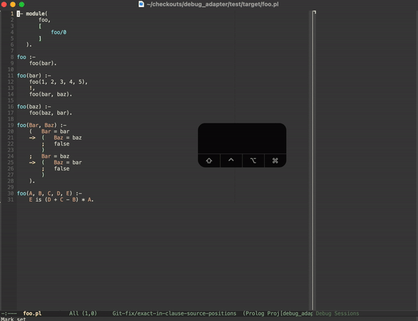

# Debug Adapter Protocol for SWI-Prolog
This repository hosts the development of [DAP](https://microsoft.github.io/debug-adapter-protocol/) for [SWI-Prolog](https://www.swi-prolog.org/), written in Prolog.

## Installation

`debug_adapter` is available as a SWI-Prolog [pack](https://www.swi-prolog.org/pack/list?p=debug_adapter), to use it simply run the following goal in the SWI-Prolog toplevel:
```prolog
?- pack_install(debug_adapter).
```

To verify the installation, run `swipl -g "[library(debug_adapter/main)]" -t halt -- -h`.

If you're using GNU Emacs with `dap-mode`, add the following lines to your `init.el`:
```elisp
(require 'dap-swi-prolog)
```

Now run `M-x dap-debug` in a Prolog buffer and have fun.

## Status
Work in progress, see [Roadmap](#roadmap)

## Roadmap
The two big milestones for this project are:
* Reaching feature parity with SWI-Prolog's [built-in graphical debugger](https://www.swi-prolog.org/pldoc/man?section=guitracer) with a DAP enabled IDE (GNU Emacs + `dap-mode` in particular), and
* Supporting the entire DAP specification

Some of the needed steps towards these goals are:

- [x] Stepping through the source code of a debugee with precise source positions
- [x] Restarting debuged frames
- [x] Supporting more debug requests - `stepOut`, `stepBack`, `next`
- [x] Providing source code for dynamic predicates through decompilation
- [ ] Installing breakpoints at source positions
- [x] Providing information about variable bindings in each frame
- [ ] Editing and reloading source code during break
- [ ] ...

## Demo

